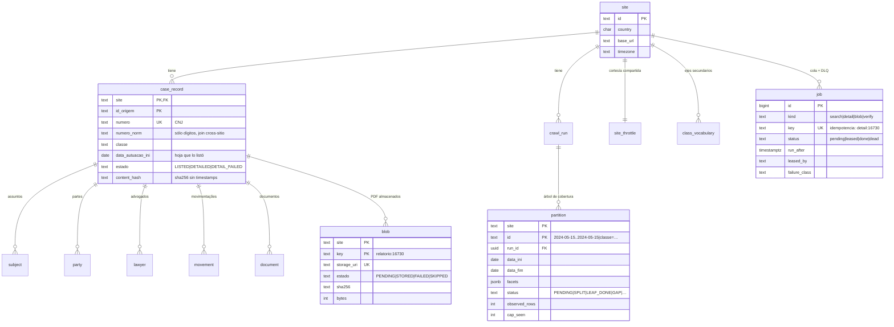

# juris-scraper

[](https://github.com/iandresfv/magnar-scraper-challenge/actions/workflows/ci.yml)

Motor de scraping judicial multi-sitio en TypeScript. El primer sitio implementado es la Consulta
Pública del PJe del **TRF5** (`pjett.trf5.jus.br`), que no pagina y corta en 30 resultados por
consulta: aquí la completitud no se pagina, **se construye**.

> Si va a leer el código, empiece por [`docs/GUIDE.md`](docs/GUIDE.md): explica los hallazgos
> sobre el sitio, la estrategia y cómo comprobarla, en 15–20 minutos de lectura.

---

## 1. Qué es, y cómo se ejecuta en 30 segundos

Un buscador judicial que responde como máximo 30 filas y no ofrece "página siguiente" no se puede
recorrer: se puede **cubrir**. El motor parte el espacio de búsqueda (rango de fechas de autuação)
hasta que ninguna consulta toque el tope, guarda todo en Postgres y después **demuestra** que las
hojas cubren el rango raíz exactamente, sin huecos ni solapes.

### Con Docker

```bash
cp .env.example .env      # opcional: todo tiene default
npm ci
npm run up                # Postgres 16.6 + RustFS (S3), espera a que estén sanos
npm start                 # crawl con los defaults
```

### Sin Docker

El mismo comando. Si `DATABASE_URL` no responde, el arranque cae a **PGlite** (Postgres compilado
a WASM, embebido) y a disco local para los PDF, y lo dice en una línea:

```bash
npm ci
DB_DRIVER=pglite BLOB_DRIVER=fs npm start
```

Es el mismo DDL y las mismas consultas: la suite de contrato de repositorios corre contra los dos
drivers. No hay un "modo degradado" con otra lógica.

### Una corrida acotada, para ver algo funcionando ya

```bash
npm run demo              # mayo 2024, hasta 10 PDF
```

Salida real de esa corrida contra el TRF5:

```
starting run 5c3d628e-f4eb-4d13-8b5e-3ef1176e2838 · site br-trf5 · root 2024-05-01..2024-05-31 · role all
seeded the root partition 2024-05-01..2024-05-31
jobs 12 done · 207 pending · 0 dead · cases 194 (0 detailed) · pdfs 0/0 · 24 jobs/min · eta ~8m 47s
jobs 26 done · 386 pending · 0 dead · cases 367 (0 detailed) · pdfs 0/0 · 26 jobs/min · eta ~15m 02s
jobs 43 done · 523 pending · 0 dead · cases 513 (0 detailed) · pdfs 0/0 · 28 jobs/min · eta ~18m 44s
jobs 69 done · 564 pending · 0 dead · cases 560 (1 detailed) · pdfs 0/5 · 33 jobs/min · eta ~16m 51s
jobs 83 done · 555 pending · 0 dead · cases 560 (15 detailed) · pdfs 0/97 · 32 jobs/min · eta ~17m 23s
```

Al terminar, `npm run verify` (11 comprobaciones), `npm run report` (los reportes de `reports/`) y
`npm run export -- --format csv` (un archivo por entidad).

> **Sobre el alcance del run publicado.** El run de evidencia que hay en `reports/` cubre
> **mayo de 2024**, no 1990→hoy. El rango raíz es un parámetro (`--root-start` / `--root-end`; el
> default del código es `1990-01-01` → hoy+1año), no un límite del motor. Un mes basta como
> evidencia porque la corrección del algoritmo no depende del tamaño del rango: la demuestran los
> tests, el invariante de teselado (`assertTiling`) y la restricción `EXCLUDE USING gist` de
> Postgres, que hace imposible el solape de hojas primarias. Y porque rastrear décadas contra un
> servidor público a 2 req/s sería exactamente el tipo de tráfico que este proyecto está
> construido para no generar. Ver [§12](#12-decisiones-supuestos-limitaciones-y-ética).

---

## 2. Por qué Postgres, y no archivos JSON

El enunciado admite archivos. El dominio no: los expedientes **se actualizan** (movimientos nuevos
sobre un caso ya visto), el crawl **se reanuda** (una corrida de horas se interrumpe) y la
completitud es una **invariante geométrica** que hay que poder afirmar sobre el conjunto entero.

Un archivo JSONL resuelve el primer volcado y ninguno de los tres problemas. Por eso toda la verdad
vive en Postgres: los datos canónicos, el árbol de particiones, la cola de trabajo, la DLQ, el
throttle compartido y las métricas. JSON y CSV existen sólo como **salida** (`npm run export`).

Dos consecuencias concretas, que son la razón de la decisión y no un efecto colateral:

```sql
-- Dos hojas primarias del mismo sitio no pueden solaparse. Ni por accidente, ni por un bug
-- del planificador: la base lo rechaza.
EXCLUDE USING gist (site WITH =, daterange(data_ini, data_fim, '[]') WITH &&)
  WHERE (status = 'LEAF_DONE' AND facets = '{}'::jsonb)
```

```sql
-- Un worker toma trabajo sin coordinarse con nadie. Si muere, el lease vence y el job vuelve.
SELECT … FROM juris.job WHERE status = 'pending' … FOR UPDATE SKIP LOCKED
```

Detalle y alternativas descartadas: [ADR 0001](docs/ADR/0001-postgres-not-json.md).

---

## 3. Cómo se vence el tope de 30

El sitio responde como máximo 30 filas y avisa —a veces— que truncó. No dice cuántas dejó fuera.
El algoritmo, entero:

```
resolve(nodo):
  page = buscar(nodo)
  si no truncó:                 el nodo es una hoja. Sus filas son todas sus filas.
  si truncó, por cada eje:      ¿alguien puede cortar este nodo más chico?
      si el eje puede:          el nodo se reemplaza por sus hijos
  si ningún eje pudo:           el nodo es un GAP — declarado, con su aritmética
```

Los ejes del TRF5, en orden ([`src/sites/br-trf5/axes.ts`](src/sites/br-trf5/axes.ts)):

1. **Fecha**: el rango se parte en mitades hasta llegar a un día, que ya no se puede partir.
2. **`classeJudicial`**: un solo día que sigue topando se parte por clase judicial, tomada del
   vocabulario que el propio sitio publica en su formulario.

Lo que hace defendible el resultado no es el algoritmo, es lo que pasa **cuando no alcanza**:

- Una partición que topa y que ningún eje puede dividir se marca `GAP`. Las filas que sí se vieron
  quedan guardadas, y el hueco se declara con números —cuántas filas eran visibles, cuánto sumaban
  los valores conocidos del eje, cuál fue el faltante— en `reports/coverage.md`.
- Al terminar, `assertTiling` exige que las hojas resueltas cubran el rango raíz **exactamente**.
  Si falta un día o dos hojas se pisan, `verify` sale con código 4.

El motor no sabe qué es una clase judicial ni qué son 30: le pregunta a los ejes del adaptador si
pueden dividir. Un sitio que paginara normalmente aportaría un eje de página y este archivo no
cambiaría ([`src/core/engine/coverageEngine.ts`](src/core/engine/coverageEngine.ts)).

---

## 4. 429, backoff, throttle compartido y DLQ

### Clasificar antes de reintentar

Cada fallo se clasifica (`RATE_LIMITED`, `SERVER_ERROR`, `NETWORK`, `TIMEOUT`, `SESSION_LOST`,
`NOT_PDF`, `PDF_TRUNCATED`, `CLIENT_ERROR`, `PARSE`, `FATAL_SITE_CHANGED`, `BUDGET_EXHAUSTED`). La
clase decide la política, en una tabla que se lee sola
([`src/core/engine/retryPolicy.ts`](src/core/engine/retryPolicy.ts)):

| Clase          | Intentos | Backoff base → tope | Por qué                                                                 |
| -------------- | -------: | ------------------- | ----------------------------------------------------------------------- |
| `RATE_LIMITED` |        6 | 1 s → 60 s          | el servidor pidió paciencia; se respeta `Retry-After` si viene          |
| `SERVER_ERROR` |        4 | 2 s → 30 s          | un 5xx suele ser transitorio; una racha significa que el sitio está mal |
| `TIMEOUT`      |        3 | 2 s → 30 s          | pudo ser sólo lentitud; tres intentos y a la DLQ                        |
| `NETWORK`      |        3 | 2 s → 30 s          | una conexión reseteada vale reintentarla; una ruta rota no vale seis    |
| `SESSION_LOST` |        2 | 0,5 s → 5 s         | el arreglo es una sesión nueva, no esperar                              |
| `NOT_PDF`      |        2 | 1 s → 10 s          | HTML donde prometieron PDF es una sesión caída                          |
| `CLIENT_ERROR` |        0 | —                   | un 4xx no se vuelve 2xx por preguntar de nuevo                          |
| `PARSE`        |        1 | —                   | reintentar no cambia un HTML que no entendemos                          |

El backoff es **jitter decorrelado** (`sleep = random(base, prev·3)`, con tope): dos workers que
fallaron juntos no vuelven juntos.

### La cortesía es del sitio, no del proceso

`juris.site_throttle` es **una fila por sitio** con la concurrencia efectiva, el bucket de tokens y
el circuit breaker. Todo request pasa por ella (`ThrottledHttpClient` decora el transporte, así que
no hay forma de hacer una petición que la saltee). Por eso `--scale worker=3` triplica el
paralelismo local sin triplicar la presión sobre el tribunal.

La ley de control es **AIMD**: sube de a uno tras éxitos sostenidos, baja a la mitad ante un 429, y
un `Retry-After` bloquea las adquisiciones de **todos** los workers hasta que pase. Arranca en 4,
techo 8, piso 1. Tras suficientes fallos consecutivos del servidor se abre el breaker; si reabrirlo
deja de servir, la corrida termina con código 2 y el estado intacto.

### DLQ

Un job que agota sus intentos queda `status='dead'`. Es una tabla, así que se consulta con SQL o
con el CLI:

```bash
npm run dlq:list -- --site br-trf5          # qué se abandonó y por qué
npm run retry-dlq -- --site br-trf5 --kind blob   # devolverlos a pending
```

### Cómo se probó sin gatillarlo contra el tribunal

Provocar un 429 en un servidor público es abusivo, y el reconocimiento nunca observó uno dentro de
un presupuesto de requests responsable. Así que el comportamiento está implementado completo y
**probado contra un tribunal falso** (`test/fake-pje-server/`) que reproduce el contrato medido:
mismo formulario JSF, mismo tope, mismo encoding, la página de rechazo del balanceador con status
200, y fallos inyectables a voluntad (`status`, `retryAfter` en segundos o como HTTP-date,
`dropConnection`, `delayMs`, `expireSession`, `htmlInsteadOfPdf`, `truncatePdfAt`, `captcha`,
`renameActionId`, `wafRejection`). Ese servidor falso es además un **sitio registrado** (`fake-pje`)
que pasa la misma suite de contrato que el TRF5: no es un mock, es un segundo adaptador.

---

## 5. Modelo de datos

DDL completo y comentado: [`src/infra/db/migrations/001_core.sql`](src/infra/db/migrations/001_core.sql).



Tres decisiones del esquema que vale la pena mirar:

- `case_record.content_hash` es el sha256 del registro canónico **sin** campos volátiles. Un
  re-crawl que no encuentra cambios no toca `updated_at`: reprocesar es gratis y auditable.
- `(site, id_origem)` es la clave primaria de todo el árbol de un expediente, con `ON DELETE
CASCADE`. El `site` va en la clave de cada tabla porque el motor es multi-sitio desde el esquema.
- `partition` guarda el árbol entero, no sólo las hojas: los `SPLIT` explican por qué existe cada
  hoja, y `observed_rows` / `cap_seen` son la aritmética que sostiene el reporte.

---

## 6. PDFs y object storage

Los documentos (relatórios y recibos) van al **API S3**. El servicio local por defecto es
[RustFS](https://rustfs.com/) (Apache 2.0), fijado a un tag exacto en `docker-compose.yml`. La misma
configuración apunta a AWS S3, a GCS por interoperabilidad HMAC o a Garage cambiando `S3_ENDPOINT`.

- **Por qué no MinIO**: era la elección obvia hasta que la edición community quedó archivada. Fijar
  una imagen sin mantenimiento en un proyecto que se entrega como referencia no es defendible.
- **Por qué no LocalStack**: exige token de cuenta incluso en su nivel gratuito, y quien evalúa
  esto no debería necesitar registrarse en nada para ejecutarlo.
- **Disco** (`BLOB_DRIVER=fs`) es el fallback, no el camino principal: no da URI estable ni se
  comparte entre procesos.

La clave es determinista, así que reintentar sobrescribe en vez de duplicar:

```
{site}/{año}/{numero}/{numero}__{tipo}[__{docId}].pdf
br-trf5/2024/0000007-07.1985.8.20.0124/0000007-07.1985.8.20.0124__relatorio.pdf
```

Cada archivo se valida **antes** de subirse: cabecera `%PDF-`, marca `%%EOF`, tamaño mínimo. Un
HTML de sesión caída no se almacena como si fuera un documento; se clasifica `NOT_PDF`, se renueva
la sesión y se reintenta una vez.

`--pdf-budget` es **por ejecución del proceso** y se reserva, no se lee: cada job de detalle pide
su parte del presupuesto y recibe lo que queda, así que `--pdf-budget 12` descarga 12 y no 386.
Reanudar una corrida vuelve a encolar los `PENDING` y concede otro presupuesto completo: tres
ejecuciones con `--pdf-budget 150` sobre la misma corrida bajan 450 documentos, no 150. Es lo que
hace útil `--pdf-budget all` para terminar lo que quedó pendiente.

Más contexto: [ADR 0002](docs/ADR/0002-s3-api-rustfs.md).

---

## 7. Reanudación, idempotencia y escalado

**Reanudar** es el caso normal, no el excepcional. Todo el estado está en Postgres: el árbol de
particiones, la cola con sus leases, el presupuesto de PDF consumido. `Ctrl+C` pide parar después
del job en curso (código 130); un segundo `Ctrl+C` sale de inmediato. En ambos casos `npm start`
retoma la misma corrida —no abre una nueva— porque una corrida sin `finished_at` cuyo rango raíz
coincide **es** esta corrida.

**Idempotencia** en tres niveles: `INSERT … ON CONFLICT DO NOTHING` sobre `(site, key)` en la cola,
`content_hash` en los expedientes (una escritura idéntica reporta `unchanged`), y `head`-antes-de-
`put` sobre una clave determinista en el object storage.

**Escalado horizontal**, sin orquestador:

```bash
npm run scale      # 1 planner + 3 workers + tribunal falso, en compose
```

El planner siembra la partición raíz y termina; los workers arrancan cuando él completó
(`service_completed_successfully`) y se reparten la cola. Salida real de esa demostración:

```
worker-1  | jobs 1107 done · 357 pending · 0 dead · cases 1295 (936 detailed) · pdfs 0/1550 · 38 jobs/min · eta ~9m 31s
worker-3  | cases      1295 listed · 1295 detailed
worker-3  | gaps       none — every partition resolved below the cap
worker-3  | exit       0 — the run completed and the queue is empty
```

Tres workers, una cola, **una** fila de throttle: el paralelismo se triplica y la presión sobre el
sitio no. La demostración corre contra el tribunal falso a propósito: una prueba de escalado es
justo el tráfico que un servidor público no debería recibir.

---

## 8. Comprobaciones de sanidad y canarios

### 11 sanity checks (`npm run verify`)

Corren sobre SQL, después de la corrida, y salen con código 4 si alguna de severidad `error` falla
([`src/core/usecases/verifyRun.ts`](src/core/usecases/verifyRun.ts)):

| id   | Qué exige                                                                |
| ---- | ------------------------------------------------------------------------ |
| S-1  | las particiones resueltas teselan el rango raíz exactamente              |
| S-2  | ninguna partición quedó sin agotar                                       |
| S-3  | todo expediente guardado fue realmente visto en una página de resultados |
| S-4  | todo número de expediente está bien formado                              |
| S-5  | los dígitos verificadores CNJ validan (mód. 97)                          |
| S-6  | ningún texto guardado tiene firma de mojibake                            |
| S-7  | los campos están poblados a la tasa esperada                             |
| S-8  | las fechas son internamente consistentes                                 |
| S-9  | los expedientes detallados tienen partes                                 |
| S-10 | todo documento almacenado tiene URI, hash y tamaño plausible             |
| S-11 | no quedó nada abandonado en la DLQ (severidad `warn`)                    |

`--sample N` además re-consulta N hojas contra el sitio vivo y compara el conteo con lo guardado:
detecta _drift_ del sitio desde el crawl. Sin `--sample`, `verify` no toca la red.

Cada check imprime su evidencia, no sólo su veredicto. Y cada check de severidad `error` tiene un
test que lo hace **fallar**, corrompiendo exactamente lo que debe notar: un verificador que sólo ve
datos buenos es indistinguible de `return ok`.

### 10 canarios (durante el crawl)

Vigilan supuestos del sitio ([`src/sites/br-trf5/canaries.ts`](src/sites/br-trf5/canaries.ts)). Si
uno de severidad `error` se rompe, la corrida se detiene con código 3: seguir produciría datos que
parecen bien y no lo están.

| id   | Supuesto vigilado                                                                          |
| ---- | ------------------------------------------------------------------------------------------ |
| C-1  | el `actionId` autogenerado de JSF sigue siendo descubrible (nunca se hardcodea)            |
| C-2  | el hook de reCAPTCHA sigue inerte (`if (false)`)                                           |
| C-3  | el formulario conserva todos los campos que la búsqueda necesita                           |
| C-4  | el tope de filas que el sitio reporta sigue siendo aquel contra el que se armó el árbol    |
| C-5  | la sonda dorada devuelve lo medido (24 filas para 2024-05-15) — atrapa la trampa del botón |
| C-6  | ningún string extraído tiene firma de mojibake (10 en una corrida es fatal)                |
| C-7  | la página de detalle conserva sus etiquetas y secciones                                    |
| C-8  | las sondas de borde fuera del rango raíz vuelven vacías (`warn`)                           |
| C-9  | ningún expediente aparece en dos hojas primarias disjuntas (`warn`)                        |
| C-10 | la respuesta no es la página "Requisição - Rejeitada" del balanceador (status 200)         |

---

## 9. Arquitectura hexagonal, y cómo añadir un sitio

`core/` (dominio, puertos, motor, casos de uso) **no importa nunca** `sites/`, `infra/` ni `app/`.
La regla la vigilan ESLint **y** un test que recorre el grafo de imports transitivo
(`test/arch/imports.test.ts`), porque una regla de capas sin test es una convención.

Un tribunal es un `SiteAdapter` + sus `Axis` + sus canarios, registrado en el `SiteRegistry`. Hay
dos adaptadores vivos —`br-trf5` y `fake-pje`— y **una** suite de contrato que ambos pasan.

- Recorrido guiado de la solución, pensado para leerse antes que el código:
  [`docs/GUIDE.md`](docs/GUIDE.md)
- Mapa de capas y algoritmo: [`docs/ARCHITECTURE.md`](docs/ARCHITECTURE.md)
- Decisiones, con alternativas descartadas y fecha: [`docs/ADR/`](docs/ADR/)
- Guía para añadir un tribunal nuevo: [`docs/adding-a-site.md`](docs/adding-a-site.md)

Lo que se puede intercambiar sin tocar el motor:

| Puerto                        | Implementaciones                           | Suite de contrato      |
| ----------------------------- | ------------------------------------------ | ---------------------- |
| `SqlExecutor`                 | Postgres (`pg`), PGlite (WASM, sin Docker) | sí, contra ambas       |
| `BlobStore`                   | S3 (RustFS/AWS/GCS/Garage), disco          | sí, contra ambas       |
| `SiteAdapter`                 | `br-trf5`, `fake-pje`                      | sí, contra ambos       |
| `JobQueue`, `Throttle`, repos | Postgres                                   | sí, en los dos drivers |

---

## 10. Configuración

Flags > variables de entorno > defaults. Todo se valida al arrancar: una corrida que falla a la
hora por un valor mal escrito desperdició una hora de alguien y una hora de capacidad de un
tribunal. `.env` lo carga Node (`node --env-file=.env`); no hay librería de configuración.

### Base de datos

| Variable          | Default     | Qué hace                                                                   |
| ----------------- | ----------- | -------------------------------------------------------------------------- |
| `DB_DRIVER`       | autodetecta | `pg` \| `pglite`. Vacío: prueba `DATABASE_URL` y cae a PGlite con un aviso |
| `DATABASE_URL`    | —           | cadena de conexión Postgres                                                |
| `DB_PATH`         | `./data/pg` | directorio de PGlite                                                       |
| `DB_AUTO_MIGRATE` | `true`      | `false` en un despliegue real, donde migrar es un paso previo              |

### Object storage

| Variable              | Default        | Qué hace                                      |
| --------------------- | -------------- | --------------------------------------------- |
| `BLOB_DRIVER`         | autodetecta    | `s3` \| `fs`                                  |
| `BLOB_DIR`            | `./data/blobs` | directorio del driver `fs`                    |
| `S3_ENDPOINT`         | —              | RustFS local, AWS, GCS (HMAC), Garage         |
| `S3_BUCKET`           | `juris`        |                                               |
| `S3_REGION`           | `us-east-1`    |                                               |
| `S3_ACCESS_KEY`       | —              |                                               |
| `S3_SECRET_KEY`       | —              |                                               |
| `S3_FORCE_PATH_STYLE` | `true`         | `false` para AWS S3 real (virtual-host style) |

### Qué se rastrea

| Variable / flag                | Default      | Qué hace                                               |
| ------------------------------ | ------------ | ------------------------------------------------------ |
| `SITE` / `--site`              | `br-trf5`    | sitio a rastrear                                       |
| `SITE_BASE_URL` / `--base-url` | —            | sólo para sitios sin URL fija (el tribunal falso)      |
| `ROLE` / `--role`              | `all`        | `all` \| `planner` \| `worker`                         |
| `ROOT_START` / `--root-start`  | `1990-01-01` | primer día del espacio de búsqueda                     |
| `ROOT_END` / `--root-end`      | hoy + 1 año  | último día                                             |
| `PDF_BUDGET` / `--pdf-budget`  | `150`        | PDF que **esta** corrida puede bajar; `all` lo levanta |
| `--max-jobs`                   | —            | corta tras N jobs, para una demo acotada               |
| `ANONYMIZE` / `--anonymize`    | `false`      | enmascara CPF/CNPJ en los reportes                     |
| `LOG_LEVEL` / `--log-level`    | `info`       |                                                        |

### Cortesía con el servidor público

| Variable          | Default | Qué hace                                       |
| ----------------- | ------- | ---------------------------------------------- |
| `CONCURRENCY`     | `4`     | concurrencia inicial, compartida entre workers |
| `CONCURRENCY_MAX` | `8`     | techo al que AIMD puede subir                  |
| `CONCURRENCY_MIN` | `1`     | piso al que un 429 puede bajar                 |
| `RATE_PER_SEC`    | `2`     | recarga del bucket de tokens                   |
| `BURST`           | `4`     | capacidad del bucket                           |

### Cola y observabilidad

| Variable       | Default      | Qué hace                                                     |
| -------------- | ------------ | ------------------------------------------------------------ |
| `LEASE_MS`     | `90000`      | cuánto retiene un worker un job antes de que otro lo tome    |
| `IDLE_POLL_MS` | `500`        | espera de un worker ocioso                                   |
| `WORKER_ID`    | hostname-pid | identifica al worker en `juris.job.leased_by`                |
| `METRICS_PORT` | —            | con valor, expone `/metrics` (texto Prometheus) y `/healthz` |

### Códigos de salida

| Código | Significado                                   |
| -----: | --------------------------------------------- |
|    `0` | la corrida completó y la cola quedó vacía     |
|    `1` | quedan jobs en la DLQ                         |
|    `2` | el circuit breaker abandonó el sitio          |
|    `3` | un canario se rompió: el sitio cambió         |
|    `4` | falló una comprobación de sanidad             |
|  `130` | interrumpido; la corrida quedó con checkpoint |

---

## 11. Testing

```bash
npm test                       # 830 tests
npm run lint && npm run typecheck
```

Cuatro clases de test, cada una respondiendo algo distinto:

- **Unitarios** — dominio y motor sin IO: fechas, número CNJ (mód. 97 con aritmética de strings),
  CPF/CNPJ, detección de mojibake, backoff, el árbol de particiones, el algoritmo de cobertura.
- **De contrato** (`test/contract/`) — la misma suite corriendo contra **varias implementaciones**:
  `SqlExecutor` y los repositorios contra Postgres y PGlite; `BlobStore` contra S3 y disco;
  `SiteAdapter` contra `br-trf5` y `fake-pje`. Un puerto con una sola implementación probada es una
  interfaz sin evidencia.
- **End-to-end** (`test/e2e/`) — crawls completos contra el tribunal falso: completitud, 429 con y
  sin `Retry-After`, sesión caída, conexión cortada, timeouts, canario roto, PDF truncado, HTML
  donde iba un PDF, reanudación sin duplicar, salida del CLI y códigos de salida.
- **De arquitectura** (`test/arch/`) — recorre el grafo de imports **transitivo** y falla si `core/`
  alcanza `sites/`, `infra/` o `app/`.

CI ([`.github/workflows/ci.yml`](.github/workflows/ci.yml)) corre cinco jobs en cada push:

1. `lint + format` — ESLint y `prettier --check`.
2. `typecheck` — `tsc --noEmit` y el build.
3. `test (postgres + rustfs)` — con servicios reales, y **una comprobación extra que falla el job si
   alguna suite de contrato se saltó en silencio**: un test skipped es un verde que prueba la mitad
   de lo que dice.
4. `test (pglite + fs, no infrastructure)` — el camino de quien no tiene Docker, verde por sí solo.
5. `runtime on the minimum supported node` — compila y **ejecuta** el CLI en Node 20.6, que es lo
   que `engines.node` promete.

Nada en CI toca el servidor del tribunal.

---

## 12. Decisiones, supuestos, limitaciones y ética

### Ética y trato al servidor público

El TRF5 es un servicio público que nadie autorizó a someter a una prueba de carga.

- Concurrencia inicial **4**, techo **8**, piso **1**, 2 req/s con bucket de tokens, compartido
  entre todos los procesos en una fila de Postgres. No es una constante escondida: es
  configuración visible y un invariante del código, porque todo request pasa por el throttle.
- AIMD baja a la mitad ante un 429 y respeta `Retry-After`; el circuit breaker abandona la corrida
  —dejándola reanudable— antes que seguir golpeando un sitio que no responde.
- El spike de reconocimiento se limitó a **40 requests**; el smoke a 5. La demostración de escalado
  (`npm run scale`) corre contra el tribunal falso, nunca contra el real.
- **Nunca se ejecutó una prueba de carga contra el sitio.** Los escenarios de 429, caída y
  saturación están probados contra el servidor falso, que reproduce el contrato medido.

### Datos personales

Los expedientes son públicos, pero contienen nombres, CPF y CNPJ.

- `data/`, `exports/`, los volúmenes de Docker y todo `.env*` están en `.gitignore` desde el primer
  commit. Los datos crudos no se publican.
- `reports/sample.md` se genera **anonimizado por defecto** (`report` enmascara CPF/CNPJ salvo que
  se pida `--no-anonymize`, y en ese caso lo dice en el archivo y en la salida).
- `export --anonymize` hace lo mismo para los volcados JSONL/CSV.

### Alcance del run publicado

`reports/` contiene un run real contra el TRF5 sobre **mayo de 2024**, no sobre el rango default
(1990 → hoy+1año). Es una decisión, no un límite:

- Lo que hay que demostrar es que el motor **cubre** un rango y lo prueba, y eso se demuestra igual
  en 31 días que en 30 años: el mismo árbol, los mismos splits por fecha y por clase, el mismo
  invariante de teselado verificado por `assertTiling` y por la restricción `EXCLUDE` de Postgres.
- El rango es un parámetro (`--root-start` / `--root-end`). Ampliarlo no requiere ningún cambio de
  código: cuesta requests y tiempo, linealmente.
- Rastrear décadas a 2 req/s significa días de tráfico continuo contra un servidor público. Ver el
  punto anterior sobre ética: no se hizo, y la razón está escrita aquí en vez de disimulada.

### Qué salió del run publicado

Los cuatro archivos de [`reports/`](reports/) son la salida real de esa corrida, no un ejemplo:

|                      |                                                                                           |
| -------------------- | ----------------------------------------------------------------------------------------- |
| Rango raíz           | 2024-05-01 .. 2024-05-31 (31 días)                                                        |
| Teselado             | 31 de 31 días cubiertos, sin huecos ni solapes                                            |
| Particiones          | 26 hojas primarias + 15 hojas por clase judicial · 27 divisiones · **0 GAP**              |
| Expedientes          | 560 encontrados, 501 con detalle completo                                                 |
| Documentos           | 310 PDF almacenados de 3.955 conocidos (presupuesto, no fallo)                            |
| `verify --sample 25` | 10/11 en verde, 1 aviso; 25 hojas re-consultadas contra el sitio vivo, **ninguna cambió** |
| Código de salida     | `1` — quedan jobs en la DLQ                                                               |

**La DLQ no está vacía, y es correcto que no lo esté.** Contiene 59 jobs `detail`, todos con la
misma firma: un 302 a `errorUnexpected.seam`. Es un expediente que el propio PJe no consigue
renderizar —el hallazgo (j) del [spike de la Fase 0](docs/spike-fase0.md), donde uno de cada cinco
tokens muestreados hizo lo mismo mientras sus vecinos de la misma respuesta funcionaban—. El
clasificador lo trata como `CLIENT_ERROR` **no reintentable** a propósito: reintentarlo seis veces
y renovar la sesión no lo arreglaría, sólo gastaría peticiones contra un tribunal. El expediente
queda marcado `DETAIL_FAILED` con su fila de búsqueda intacta, y la tasa —59 de 560, un 10,5%—
se publica en vez de esconderse. La alternativa, descartada, era descartar esos expedientes: un
scraper que borra lo que no puede leer miente sobre su propia cobertura.

Dos comprobaciones salieron en verde **con reservas visibles**, que es como están diseñadas:

- S-5: 1 número de 560 no valida su dígito verificador (`0003841-02.2015.8.06.0167`, un número de
  tribunal estatal citado como referencia). El tribunal es la fuente de verdad; la comprobación
  es de severidad `warn` con tolerancia del 1%, porque un scraper que descartara las filas que no
  le gustan sería peor que uno que las señala.
- S-8: 20 de 560 tienen fecha de distribución fuera de la partición que los listó (tolerancia 5%).
  El sitio filtra por fecha de autuação y muestra la de distribución: no siempre coinciden.

### Supuestos que el código vigila

Cada supuesto sobre el sitio tiene un canario que lo mata si deja de ser cierto (§8). Los más
caros de descubrir, y ya incorporados:

- El formulario es **ISO-8859-1**. `URLSearchParams` siempre codifica en UTF-8, así que filtrar por
  `classeJudicial` con acentos devolvía 0 filas hasta que el cuerpo se codificó en latin1.
- La coincidencia de clase judicial es por **prefijo** e insensible a acentos.
- Un header `Cookie:` vacío hace que el balanceador F5 conteste **200** con la página
  "Requisição - Rejeitada" (medido sobre 5 variantes de headers). El transporte omite el header
  cuando el jar está vacío, y la página es el canario C-10.
- El `actionId` de JSF se renumera en cada redespliegue: se deriva por regex en cada corrida.

### Limitaciones conocidas

- El motor asume que `dataAutuação` es un día único por expediente. C-9 vigila que ningún caso
  aparezca en dos hojas disjuntas; si apareciera, el argumento de completitud habría que revisarlo.
- Un `GAP` es un hueco real del sitio, no del crawler: significa que ni la fecha ni la clase pueden
  dividir más una consulta que sigue topando. Se declara con su aritmética en `coverage.md`.
- El throttle en Postgres es un UPDATE por adquisición con caché local de 1 s. A 2 req/s es ruido;
  por encima de ~50 req/s por sitio habría que moverlo a Redis. Está documentado, no escondido.
- `SKIP LOCKED` con PGlite es correcto pero irrelevante: hay una sola conexión. El modo sin Docker
  usa concurrencia in-process.

---

## Licencia

MIT — ver [LICENSE](LICENSE).
